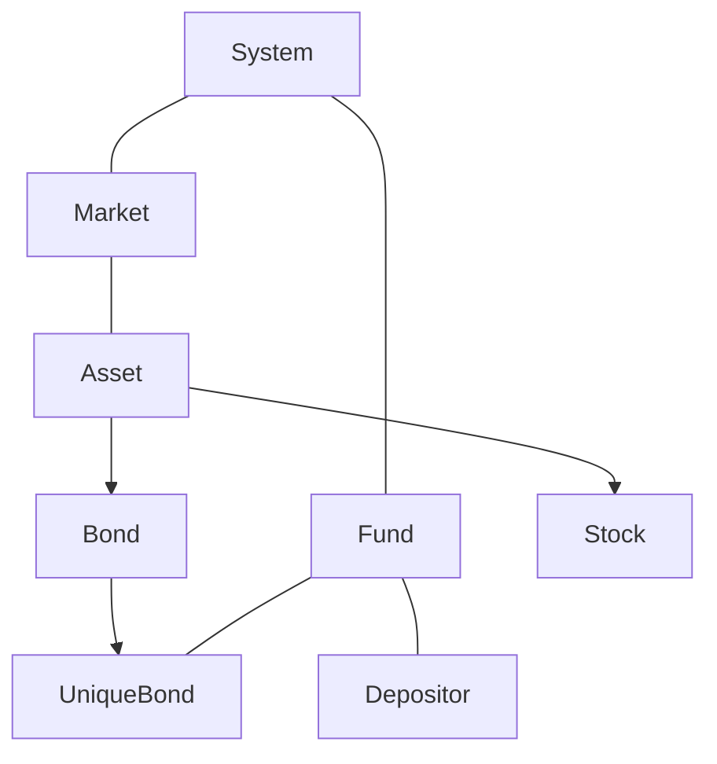

class Market {

		(...)
 
		std::map<Currency, Bond> bonds;
 
    	std::map<Currency, Stock> stocks;
     
    	std::map<Currency, Asset> assets;
     
};

class System {

		(...)
 
		Fund fund;
 
    	Market market;
     
};

class Fund {

		(...)
 
		std::vector<Depositor> depositors;
 
    	std::vector<UniqueBond> bonds;
     
    	std::map<Currency, int> stocks;
     
    	std::map<Currency, double> assets;
     
    	std::vector<double> deposits;
     
};
